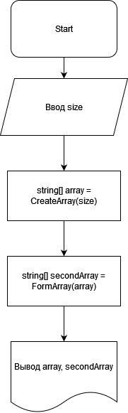

# Решение задачи
**Этап 1.** Определение размера исходного массива путем ввода с клавиатуры пользователем.

**Этап 2.** Создание исходного массива строчного типа.

**Этап 3.** Формирование нового массива из строк, длина которых > или = 3 методом нахождения элементов, соответствующих данному условию.

